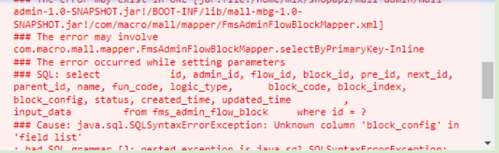

# Express 对异常的统一处理

项目开发过程中，优雅地处理异常是一个好的工程师必备的素养。最近在项目开发过程中，
经常捕获到一些奇怪的异常（如下图）。显然，这是没有对异常进行处理的结果。



下面 👇，我们将采用 `Express` + `Typescript` 来演示如何对异常进行处理。

通过本文，你可以学到以下知识 👏：

- 捕获所有类型的异常。
- 用一个处理器对所有的异常进行统一处理。
- 自定义异常处理中间件。
- 自定义 `Error` 类。

## 预备条件

环境配置

```sh
yarn init --yes

yarn add express
yarn add -D @types/express @types/node ts-node-dev typescript cross-en

# Windows 注意 shell 环境的差异
mkdir src
touch src/index.ts
```

启动：

```typescript
// src/index.ts
import express from "express";
import { router } from "./routes";

const app = express();
const PORT = 3002;

app.use(router);

app.listen(PORT, () => {
  console.log(`server is listening on ${PORT}`);
});
```

## 同步异常捕获

通常最好的做法是捕获所有的异常，并根据不同的异常做出处理。有时候我们会忘记对异常进行处理，好在 `Express` 会默认将同步异常交由中间件进行处理。

可以看以下示例：

```typescript
// src/routes/index.ts
import express from "express";
export const router = express();

router.get("/", (req, res) => {
  throw new Error("this is an error");
  res.json({ message: "ok" });
});
```

当我们访问 `/` 时，会看到如下异常：

```sh
Error: this is a error
...
```

在生产环境（`NODE_ENV='production'`）时，`Express` 会对同步异常进行加工处理，
于是我们的请求结果为

```
Internal Server Error
```

然而，对于异步异常 `Express` 是不会进行处理的。

## 异步异常捕获

在 `Express` 4 及以下版本中，异步异常会被跳过。

来看下面基于 `Express4` 的示例，我们在 `Promise` 中 抛出一个异常，这种异常
有可能出现在我们访问数据库过程中出现：

```typescript
// src/routes/index.ts
router.get("/async-error", async (req, res) => {
  function _getUserFromDb() {
    return new Promise(() => {
      throw new Error("this is an error");
    });
  }

  const data = await _getUserFromDb();
  return res.json({ user: data }).end();
});
```

当我们访问 `/async-error` 时，可以看到以下异常信息：

```sh
(node:21168) UnhandledPromiseRejectionWarning: Error: this is an error
```

这是我们对于 Promise Rejection 异常没有进行处理。正确的做法是在外面套一层 `try/catch`，同时使用 `next(error)` 将异常交由 `Express` 异常中间件进行处理：

```typescript
// src/routes/index.ts
router.get("/async-error", async (req, res, next) => {
  function _getUserFromDb() {
    return new Promise(() => {
      throw new Error("this is an error");
    });
  }

  try {
    const data = await _getUserFromDb();
    return res.json({ user: data }).end();
  } catch (err) {
    next(err);
  }
});
```

但是，这种异常处理方式非常繁琐，对于当个请求还好处理，一旦请求多了，对于每一个请求都
写 `try/catch` 显然太不实际。

当然，我们可以借助第三方异常处理中间件，帮我们 `catch` 住异步异常，这里采用
`express-async-errors`。

我们还是先安装依赖：

```sh
yarn add express-async-errors
```

改造以下我们的异步请求：

```typescript
// src/routes/index.ts
import express from "express";
import "express-async-errors";
export const router = express();

router.get("/async-error", async (req, res, next) => {
  function _getUserFromDb() {
    return new Promise(() => {
      throw new Error("this is an error");
    });
  }

  // 👇：不再使用 try catch
  const data = await _getUserFromDb();
  return res.json({ user: data }).end();
});
```

再次访问可以看到的异常信息就已经发生改变了，不再是 `UnhandledPromiseRejectionWarning`：

```sh
Error: this is an error
```

其实，`express-async-errors` 是带有副作用的函数，它帮我们对
`Express Router` 进行加工，也就是对 `Promise` 异常进行封装处理，
可以简要看一下它的源码：

```javascript
// express-async-errors

function wrap(fn) {
  const newFn = function newFn(...args) {
    // 获取到 handler 函数。
    const ret = fn.apply(this, args);
    const next = (args.length === 5 ? args[2] : last(args)) || noop;
    // 检查执行结果是否是一个 Promise，并对 Promise 异常进行处理。
    if (ret && ret.catch) ret.catch((err) => next(err));
    return ret;
  };
  Object.defineProperty(newFn, "length", {
    value: fn.length,
    writable: false,
  });
  return copyFnProps(fn, newFn);
}
```

到目前以为，我们已经掌握 `Express` 对于同步异常和异步异常的处理。
但是还有一些异常是超出 `Express` 的管理范围的，下面我们继续展开讨论。

## 处理未捕获异常

## 自定义异常处理中间件

## 自定义异常处理

### 自定义处理类

### 使用

## 异常处理

## 总结

## 参考文章

- [How to Handle Errors in Express with TypeScript](https://www.codeconcisely.com/posts/how-to-handle-errors-in-express-with-typescript/)
