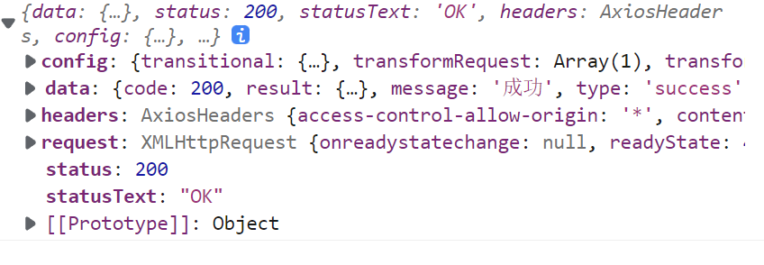
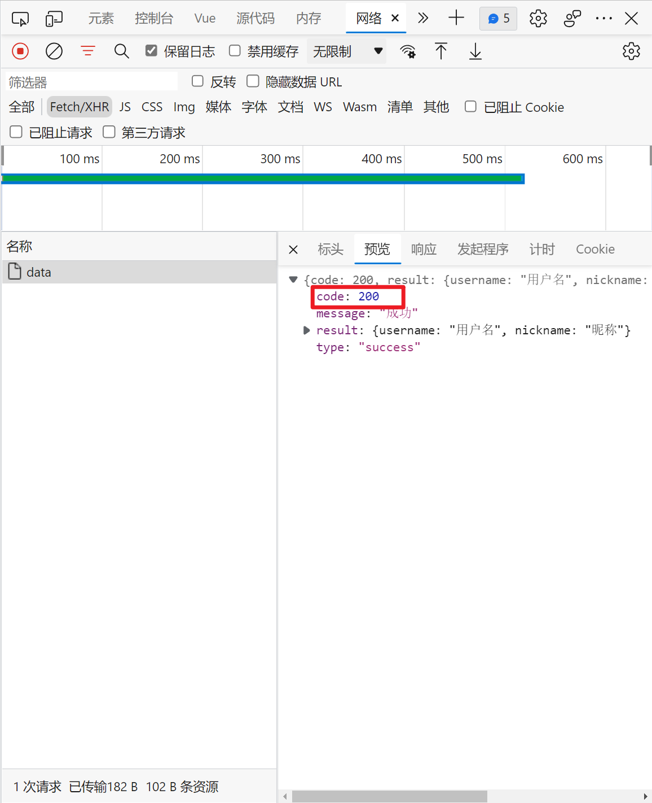

# 一步步教你封装 axios

## 写在前面

本期参考的项目是 vue3 个一个开源 admin 项目：
[vue-vben-admin](https://github.com/vbenjs/vue-vben-admin)

## 为什么要封装 axios

axios 作为前端最受欢迎的网络请求库，只提供了最基本的网络封装，
但是落实到业务层面，进一步的封装有利于我们使用起来更为便捷。

例如：我们请求后端接口后，返回的数据如下所示：



每次我们要拿到后端返回的数据，我们不得不采用如下的方式：

```javascript
axios
  .request({
    method: 'get',
    url: '/api/data',
  })
  .then((res) => {
    const data = res.data
  })
```

当接口数量多起来的时候，会存在**大量**重复的代码。其次，在大多数公司里面，
网络请求状态默认是 200，本次请求正确与否会根据一个状态码来标识，如下图：

（状态码由内部规定，这里我们把 `code=200` 认为是本次请求是成功的，
`code≠200` 我们认为是失败的）



所以，本次请求是否成功我们还需要进一步判断：

```javascript
axios
  .request({
    method: 'get',
    url: '/api/data',
  })
  .then((res) => {
    const data = res.data
    if (data.code != 200) {
      throw new Error(data.message)
    } else {
      return data.result
    }
  })
```

当然我们可以用 axios 的 拦截器功能实现：

```javascript
const http = axios.create()
http.interceptors.response.use((res) => {
  const { data } = res
  if (data.code != 200) {
    throw new Error(data.message)
  } else {
    return data.result
  }
})
```

在上面的代码中，我们不仅要创建 axios 实例（AxiosInstance），同时还需要配置拦截器，
能否我们在一开始创建的时候就传入 interceptors？
答案是否定的。axios 没有提供一开始传入 interceptors 的功能。

有时候我们又需要拿到原始 axios 请求对象，来拿到网络请求的 `config`，用拦截器后，我们就
拿不到 `config`，那有没有办法在发起请求时候我们简单配置后就可以拿到原始的网络请求，例如：

```javascript
myAxios.request(
  {
    method: 'get',
    url: '/api/data',
  },
  {
    // 返回原始 axios 响应
    isReturnNativeResponse: true,
  },
)
```

---

再者说，axios 也提供了取消网络请求的功能，我们可以用来取消重复的请求，
但是每次都手动管理会非常繁琐，我们能否统一配置，只要我们修改配置参数，
我们的请求就自动开启取消重复请求的功能，如下：

```javascript
myAxios.request(
  {
    method: 'get',
    url: '/api/data',
  },
  {
    // 忽略重复请求
    ignoreCancel: true,
  },
)

myAxios.request(
  {
    method: 'get',
    url: '/api/data',
  },
  {
    // 允许重复请求
    ignoreCancel: false,
  },
)
```

本文参考 vue-vben-admin 项目中 axios 对 axios 的封装所写的，
提取了较为核心的部分作为分享。

## 基础配置

### API 接口

### 依赖说明

## 拦截器

## 取消重复请求

## 支持 form-data

## http 请求

## 默认配置

## 总结
