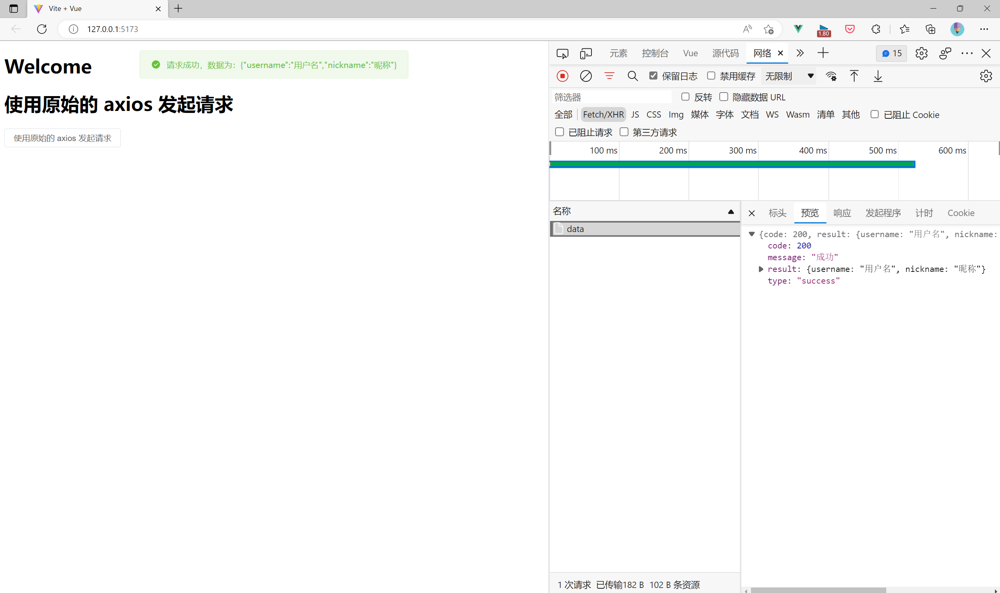
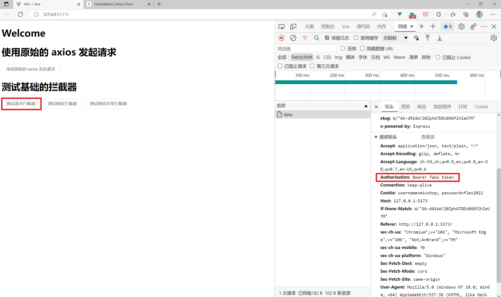
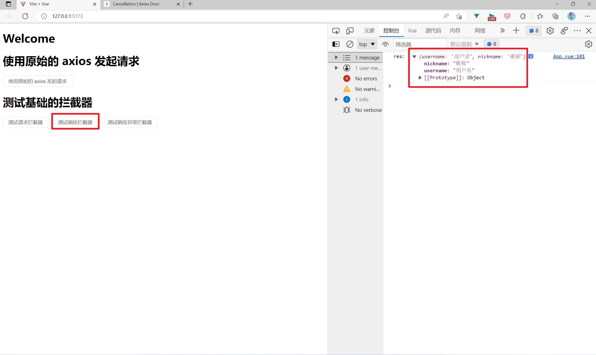
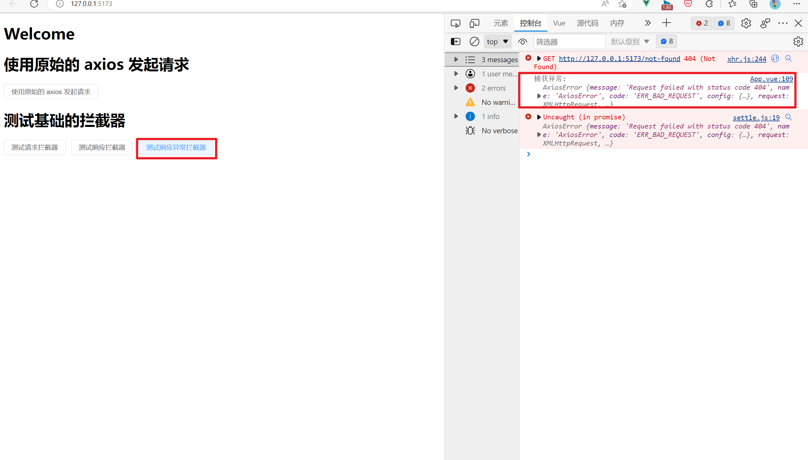
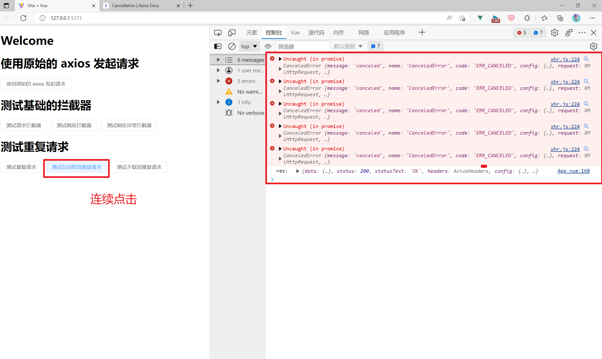
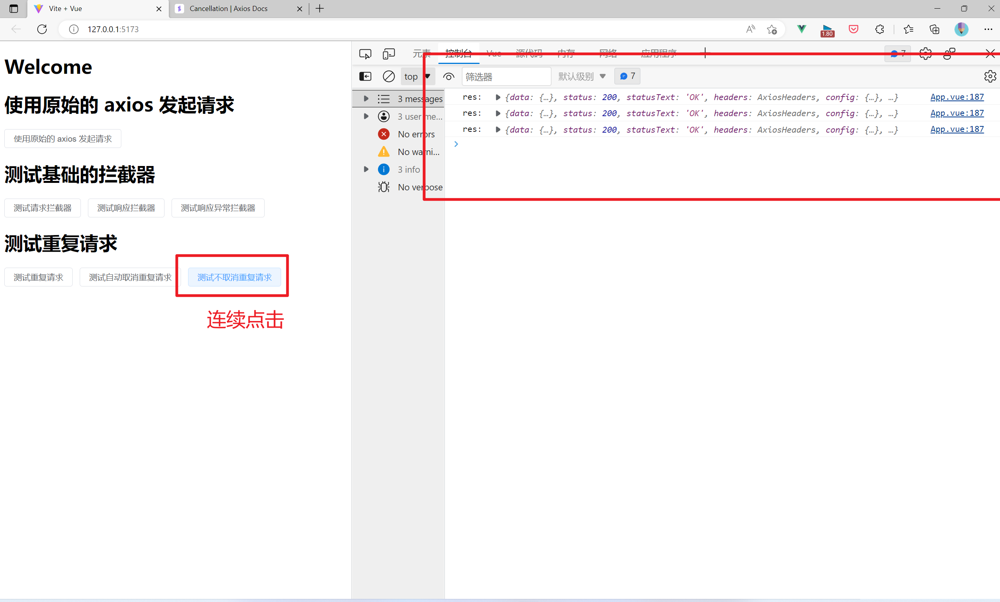

# 跟着开源项目学封装 axios

## 写在前面

本期参考的项目是 vue3 个一个开源 admin 项目：
[vue-vben-admin](https://github.com/vbenjs/vue-vben-admin)

## 为什么要封装 axios

axios 作为前端最受欢迎的网络请求库，只提供了最基本的网络封装，
但是落实到业务层面，进一步的封装有利于我们使用起来更为便捷。

例如：我们请求后端接口后，返回的数据如下所示：


每次我们要拿到后端返回的数据，我们不得不采用如下的方式：

```javascript
axios
  .request({
    method: 'get',
    url: '/api/data',
  })
  .then((res) => {
    const data = res.data
  })
```

当接口数量多起来的时候，会存在**大量**重复的代码。其次，在大多数公司里面，
网络请求状态默认是 200，本次请求正确与否会根据一个状态码来标识，如下图：

（状态码由内部规定，这里我们把 `code=200` 认为是本次请求是成功的，
`code≠200` 我们认为是失败的）


所以，本次请求是否成功我们还需要进一步判断：

```javascript
axios
  .request({
    method: 'get',
    url: '/api/data',
  })
  .then((res) => {
    const data = res.data
    if (data.code != 200) {
      throw new Error(data.message)
    } else {
      return data.result
    }
  })
```

当然我们可以用 axios 的 拦截器功能实现：

```javascript
const http = axios.create()
http.interceptors.response.use((res) => {
  const { data } = res
  if (data.code != 200) {
    throw new Error(data.message)
  } else {
    return data.result
  }
})
```

在上面的代码中，我们不仅要创建 axios 实例（AxiosInstance），同时还需要配置拦截器，
能否我们在一开始创建的时候就传入 interceptors？
答案是否定的。axios 没有提供一开始传入 interceptors 的功能。

有时候我们又需要拿到原始 axios 请求对象，来拿到网络请求的 `config`，用拦截器后，我们就
拿不到 `config`，那有没有办法在发起请求时候我们简单配置后就可以拿到原始的网络请求，例如：

```javascript
myAxios.request(
  {
    method: 'get',
    url: '/api/data',
  },
  {
    // 返回原始 axios 响应
    isReturnNativeResponse: true,
  },
)
```

---

再者说，axios 也提供了取消网络请求的功能，我们可以用来取消重复的请求，
但是每次都手动管理会非常繁琐，我们能否统一配置，只要我们修改配置参数，
我们的请求就自动开启取消重复请求的功能，如下：

```javascript
myAxios.request(
  {
    method: 'get',
    url: '/api/data',
  },
  {
    // 忽略重复请求
    ignoreCancel: true,
  },
)

myAxios.request(
  {
    method: 'get',
    url: '/api/data',
  },
  {
    // 允许重复请求
    ignoreCancel: false,
  },
)
```

本文参考 vue-vben-admin 项目中 axios 对 axios 的封装所写的，
提取了较为核心的部分作为分享。

## 基础配置

在开始本项目之前，请 clone 项目所在的代码仓库，并切换到 `chore: 1. 提供基础的工具` 分支下。

完成后，我们可以看到当前的目录结果如下：

```sh
├───backend # 模拟后端接口请求
├───frontend # 用于调试的前端 app
└───lib # 我们进行封装的 axios
```

在仓库的**根目录** `npm run bootstrap` 安装三个库所需要的依赖。
依赖安装完成后，我们运行 `npm run dev:server` 和 `npm run dev:client` 分别启动
我们的服务器和客户端（涉及到 vite 代理，这里需要先启动服务器）。

后端接口链接为：[http://localhost:3000](http://localhost:3000)

前端 app 链接为：[http://127.0.0.1:5173/](http://127.0.0.1:5173/)

我们打开前端 app，点击按钮，看到如下图所示，表示我们已经启动成功：



### API 接口

api 接口链接： http://localhost:3000/api
用于我们用了 vite 代理，会将 `http://127.0.0.1:5173/api` 的请求代理
到 `http://localhost:3000/api` 上，所以我们在前端调用的 axios 请求如下：

```javascript
axios.request({
  method: 'get',
  // 相当于 http://localhost:5173/api/data
  // 经过代理后会转发到 http://localhost:3000/api/data
  url: '/api/data',
})
```

默认请求格式：application:json
默认延迟返回：200 ms

统一返回的数据为：

```javascript
const response = {
  code: 200, // 本次请求的状态码，200 表示成功。
  result: {}, // 本次请求的结果。
  message: '成功', // 本次请求的消息，用于前端展示（如果需要的话）。
  type: 'success', // 类型，可以用于配置 message box，也可以忽略，为 'success', 'warning', 'error' 一个。
}
```

本项目提供了几个简单的接口：

- `GET /api/data`：获取数据。
- `GET /api/error`：模拟请求失败。
- `POST /api/login`：模拟登录，成功返回 `access_token`。
  ```javascript
  // 表单数据
  const data = { username: 'admin', password: 'admin' }
  ```
- `GET /api/sleep`：模拟延迟返回结果。

  ```javascript
  // 请求参数
  const params = { timeout: 200 }
  ```

- `GET /api/secret`：模拟需要认证的请求。
  ```javascript
  // 请求头
  const headers = { Authorization: 'Bearer fake token' }
  ```

具体实现请看 `/backend/src/index.js`

### 依赖说明

1. 我们封装的 axios 要求版本在 `v0.22.0` 及以上。
   （会用到 `AbortController`，如果实际项目低于该版本，需要调整一下取消重复请求部分的代码，
   但总体逻辑不变。）
2. 本项目的 utils 会依赖到 `lodash-es`，可以根据实际需要调整。所有的工具依赖存放在 `/lib/src/utils.js` 下。

在项目开始之前，我们先实现几个简单工具类：

```javascript
// /lib/src/utils.js
import { merge } from 'lodash-es'
export { clone, cloneDeep, isFunction, isString } from 'lodash-es'

/**
 * 浅合并对象，返回一个全新的对象，并且不会影响原有的对象。
 */
export function shallowMerge(...objects) {
  return Object.assign({}, ...objects)
}

/**
 * 深合并对象，返回一个全新的对象，并且不会影响原有的对象。
 */
export function deepMerge(...objects) {
  return merge({}, ...objects)
}

/**
 * 将 v 强制转为 boolean
 * @param {*} v
 * @returns { boolean }
 */
export function toBoolean(v) {
  return !!v
}

/**
 * 延迟执行
 * @param { number } timeout
 */
export function sleep(timeout) {
  return new Promise((resolve) => setTimeout(resolve, timeout))
}

export const delay = sleep

/**
 * 空值判断
 * @param { unknown } v
 * @returns { boolean }
 */
export function isVoid(v) {
  return v === null || v === undefined || v === ''
}
```

## 拦截器

在前面我们提到了 axios 拦截器需要实例化后才能添加。为了实现一开始实例化 axios 时，
通过参数配置拦截器，我们需要对 axios 进行封装。

基于**组合优于继承**的设计理念，我们会创建自己的 axios 类（VAxios），并采用组合的方式对其进行拓展。
我们的 VAxios 会在原先 axios 实例对象参数基础上添加几个重要的参数：

```typescript
// /lib/typings/index.d.ts
export interface CreateAxiosOptions extends AxiosRequestConfig {
  // 认证模型，默认为 Bearer （jwt token）
  authenticationScheme?: string
  // 存放所有对数据进行转换的函数
  transform: AxiosTransform
  // 实际请求的配置项
  requestOptions: RequestOptions
}
```

（本项目是基于 javascript 实现的，对 typescript 不太熟悉也不会影响对后续的实现逻辑）

我们期望的效果如下：

```javascript
const myAxios = new VAxios({
  transform: {
    requestInterceptors: () => {},
    requestInterceptorsCatch: () => {},
    responseInterceptors: () => {},
    responseInterceptorsCatch: () => {},
  },
  // ...原始 axios config
})
```

当传入的 `transform` 有对应的拦截函数，VAxios 自动帮我们注册拦截器。

下面让我们实现第一版的拦截器：

```javascript
// /lib/src/v-axios.js
import axios from 'axios'
import { isFunction } from './utils'

export class VAxios {
  /**
   * @param { import('./typings').CreateAxiosOptions } options
   */
  constructor(options) {
    this._options = options || {}
    this._axiosInstance = axios.create(options)
    this._setupInterceptor()
  }

  _setupInterceptor() {
    const { transform } = this._options
    const {
      requestInterceptors,
      requestInterceptorsCatch,
      responseInterceptors,
      responseInterceptorsCatch,
    } = transform || {}

    // 添加请求拦截器
    if (isFunction(requestInterceptors)) {
      this._axiosInstance.interceptors.request.use((config) => {
        // 为了针对不同请求进行处理，我们将实例化的 options 也一并传过去
        return requestInterceptors(config, this._options)
      })
    }

    // 添加请求异常拦截器
    if (isFunction(requestInterceptorsCatch)) {
      this._axiosInstance.interceptors.request.use(undefined, (error) => {
        return requestInterceptorsCatch(error, this._options)
      })
    }

    // 添加响应拦截器
    if (isFunction(responseInterceptors)) {
      // 后面我们会合并配置，所有的配置会存放到 res.config 下，所以我们只需要传 res
      this._axiosInstance.interceptors.response.use((res) => {
        return responseInterceptors(res)
      })
    }

    // 添加响应异常拦截器
    if (isFunction(responseInterceptorsCatch)) {
      this._axiosInstance.interceptors.response.use(undefined, (error) => {
        // 涉及到超时请求我们把 axiosInstance 也一并传过去
        // 方便超时进行请求
        return responseInterceptorsCatch(this._axiosInstance, error)
      })
    }
  }
}
```

接下来，我们在前端 app 简单测试下：

```vue
<template>
  <!-- /frontend/src/App.vue -->
  <div>
    <h1>
      测试基础的拦截器
    </h1>
    <el-button @click="handleTestRequestInterceptor()">
      测试请求拦截器
    </el-button>

    <el-button @click="handleTestResponseInterceptor()">
      测试响应拦截器
    </el-button>

    <el-button @click="handleTestResponseCatchInterceptor()">
      测试响应异常拦截器
    </el-button>
  </div>
</template>

<script>
import axios from 'axios'
import { ElMessage } from 'element-plus'
import { VAxios } from '../../lib/src/v-axios'

export default {
  setup() {
    const handleTestRequestInterceptor = () => {
      const vAxios = new VAxios({
        transform: {
          requestInterceptors(config, options) {
            const headers = config.headers
            headers['Authorization'] = `Bearer fake token`
            config.headers = headers

            // 注意返回 config，否则无法执行
            return config
          },
        },
      })

      // 不推荐直接用 _axiosInstance 发起请求，后面会优化
      vAxios._axiosInstance
        .request({
          url: '/api/data',
        })
        .then((res) => {
          console.log('res: ', res)
        })
    }

    const handleTestResponseInterceptor = () => {
      const vAxios = new VAxios({
        transform: {
          responseInterceptors(res) {
            const { data } = res
            if (data.code == 200) return data.result
            throw new Error(data.message)
          },
        },
      })

      // 不推荐直接用 _axiosInstance 发起请求，后面会优化
      vAxios._axiosInstance
        .request({
          url: '/api/data',
        })
        .then((res) => {
          console.log('res: ', res)
        })
    }

    const handleTestResponseCatchInterceptor = () => {
      const vAxios = new VAxios({
        transform: {
          responseInterceptorsCatch(instance, error) {
            console.log('捕获异常: ', error)
            throw error
          },
        },
      })

      // 不推荐直接用 _axiosInstance 发起请求，后面会优化
      vAxios._axiosInstance.request({
        url: '/not-found',
      })
    }

    return {
      handleTestRequestInterceptor,
      handleTestResponseInterceptor,
      handleTestResponseCatchInterceptor,
    }
  },
}
</script>
```

1. 测试请求拦截器：当我们点击 `测试请求拦截器` 后，我们可以在网络请求看到 header 上自动加上 `Authorization`
   说明我们配置成功。
   

2. 测试响应拦截器：当我们点击 `测试响应拦截器` 后，我们可以在网络请求看到请求成功，并在**控制台**打印出实际的结果，说明我们配置成功。
   
3. 测试响应异常拦截器：我们请求一个**不存在**的接口，当我们点击 `测试响应异常拦截器` 后，在**控制台**打印出错误异常，说明我们配置成功。
   

细心的小伙伴也发现了，我们并没有对请求异常进行测试。这是因为这种情况很少出现，其次我们也可以其他手段捕获到请求
异常，这里我们就不进行测试。

## 取消重复请求

我们将采用 `AbortController` 来实现取消重复请求的功能，预期效果跟我们前面讨论的一样，
通过一个简单的配置实现自动取消重复请求。

关于 axios 如何用 `AbortController` 取消请求可以看官方文档：
[https://axios-http.com/docs/cancellation](https://axios-http.com/docs/cancellation)

为了比较两次实现的效果，我们先提供几个测试案例：

```vue
<template>
  <div>
    <h1>测试重复请求</h1>
    <el-button @click="handleTestRepeatRequest1">
      测试重复请求
    </el-button>
    <el-button @click="handleTestCancelRepeatRequest">
      测试自动取消重复请求
    </el-button>
    <el-button @click="handleTestRepeatRequest2">
      测试不取消重复请求
    </el-button>
  </div>
</template>

<script>
import axios from 'axios'
import { ElMessage } from 'element-plus'
import { VAxios } from '../../lib/src/v-axios'

export default {
  setup() {
    // ===========================
    // 测试重复请求
    // 注意：需要在 handler 外面先实例化（new）VAxios，保证同一个 handler
    //      多次调用是同一个实例。
    const vAxios1 = new VAxios({})
    const handleTestRepeatRequest1 = () => {
      // 默认支持取消重复请求
      vAxios1._axiosInstance
        .request({
          url: '/api/sleep',
          params: {
            timeout: 2 * 1000,
          },
        })
        .then((res) => {
          console.log('res: ', res)
        })
    }

    const vAxios2 = new VAxios({
      requestOptions: {
        // 取消重复请求
        ignoreCancel: true,
      },
    })
    const handleTestCancelRepeatRequest = () => {
      vAxios2._axiosInstance
        .request({
          url: '/api/sleep',
          params: {
            timeout: 2 * 1000,
          },
        })
        .then((res) => {
          console.log('res: ', res)
        })
    }

    const vAxios3 = new VAxios({
      requestOptions: {
        // 不取消重复请求
        ignoreCancel: false,
      },
    })
    const handleTestRepeatRequest2 = () => {
      vAxios3._axiosInstance
        .request({
          url: '/api/sleep',
          params: {
            timeout: 2 * 1000,
          },
        })
        .then((res) => {
          console.log('res: ', res)
        })
    }

    return {
      handleTestRepeatRequest1,
      handleTestRepeatRequest2,
      handleTestCancelRepeatRequest,
    }
  },
}
</script>
```

当我们在页面**疯狂点击**测试重复请求按钮的时候，我们可以网络请求看到我们发起 N 个请求，同时控制台
也输出了 N 次数据。有两种常用的方案来避免重复请求：

1. 直接取消重复的请求。
2. 缓存请求。

这里我们采用第一种方案。

参考 axios 官方文档，我们只需要在请求中加入 `signal` 参数后，我们就可以控制本次请求：

```javascript
// 下面代码复制于 https://axios-http.com/docs/cancellation
// AbortController 是浏览器自带的 API
const controller = new AbortController()

axios
  .get('/foo/bar', {
    signal: controller.signal,
  })
  .then(function (response) {
    //...
  })
// cancel the request
controller.abort()
```

为了方便管理，我们需要创建一个 `VAxiosCanceller` 类来管理一个 `VAxios` 所有的请求。
为了规范化处理，我们提供几个常量和工具函数方便我们后续使用：

```javascript
// lib/src/constant.js
export const ContentTypes = {
  // json
  JSON: 'application/json;charset=UTF-8',
  // form-data qs
  FORM_URLENCODED: 'application/x-www-form-urlencoded;charset=UTF-8',
  // form-data  upload
  FORM_DATA: 'multipart/form-data;charset=UTF-8',
}

export const HttpMethods = {
  GET: 'GET',
  POST: 'POST',
  PUT: 'PUT',
  DELETE: 'DELETE',
}

export const ErrorCodes = {
  SUCCESS: 200,
  UNAUTHORIZED: 10401,
}

// lib/src/utils.js
import { HttpMethods } from './constant'

/**
 * 规范化请求方法。
 * @param { string? } httpMethod
 */
export function normalizeHttpMethod(httpMethod) {
  httpMethod = httpMethod || HttpMethods.GET
  httpMethod = httpMethod.toUpperCase()
  return httpMethod
}
```

接下来实现我们的 `VAxiosCanceller`

```javascript
// /lib/src/v-axios-canceller.js

import { normalizeHttpMethod } from './utils'

/**
 * 获取请求的唯一标识。
 * @param { import("axios").AxiosRequestConfig } config
 * @returns { string }
 */
function getIdentifier(config) {
  let { method, url, params } = config
  method = normalizeHttpMethod(method)
  url = url || ''
  params = JSON.stringify(params || {})
  return [method, url, params].join('&')
}

export class VAxiosCanceller {
  constructor() {
    /**
     * @type { Map<string, AbortController> }
     */
    this._identifierToCancellerMap = new Map()
  }

  /**
   * @param { import("axios").AxiosRequestConfig } config
   */
  addPending(config) {
    if (config.signal != null) return

    // 取消重复请求，并删除缓存
    this.removeAndCancelPending(config)

    const identifier = getIdentifier(config)
    // 将当前请求存储到 map中
    // 控制判断是为了兼容手动取消
    const controller = new AbortController()
    config.signal = controller.signal
    this._identifierToCancellerMap.set(identifier, controller)
  }

  /**
   * 取消重复请求，并删除缓存
   * @param { import("axios").AxiosRequestConfig } config
   */
  removeAndCancelPending(config) {
    const identifier = getIdentifier(config)
    const controller = this._identifierToCancellerMap.get(identifier)
    // 存在重复请求
    if (controller != null) {
      controller.abort()
      config.signal = null
      this._identifierToCancellerMap.delete(identifier)
    }
  }

  /**
   * 删除缓存，但不取消请求
   * @param { import("axios").AxiosRequestConfig } config
   */
  removePending(config) {
    const identifier = getIdentifier(config)
    if (this._identifierToCancellerMap.has(identifier)) {
      this._identifierToCancellerMap.delete(identifier)
    }
  }

  /**
   * 取消所有的请求，并清空缓存
   */
  removeAndCancelAllPending() {
    this._identifierToCancellerMap.forEach((controller) => controller.abort())
    this._identifierToCancellerMap.clear()
  }

  /**
   * 重置缓存
   */
  reset() {
    this._identifierToCancellerMap = new Map()
  }
}
```

我们用请求的 `method`, `url`, `params` 作为标识唯一请求的 id。
每次发起请求的时候，我们会生成唯一的 id，然后检查缓存（`_identifierToCancellerMap`）
中是否有正在运行的请求，如果存在的话，去取消重复的请求。

**注意**：我们执行 `addPending` 之前需要去检查是否 `config.signal` 存在，
这是因为可能我们会手动取消请求。同时，在取消重复请求后，我们需要清空 `config.signal`。

```javascript
// 模拟手动取消请求
const controller = new AbortController()
vAxios._axiosInstance.request({
  url: '/api/sleep',
  params: {
    timeout: 2 * 1000,
  },
  signal: controller.signal,
})
```

接下来我们需要考虑如何**优雅**实现自动取消了。
自动取消重复的思路如下：

1. 在发起请求之前，我们为当前请求生成唯一的 id，放入请求观察队列中（在这里就是我们的 \_identifierToCancellerMap）。
2. 请求完成后，在请求观察队列中删除该请求。
3. 如果请求还没有完成，又发起同样的请求，我们则从观察队列中拿到 `canceller`，将之前的请求废弃。

所以我们可以在每次请求的时候都将请求放入队列（\_identifierToCancellerMap）中，完成后删除即可。

这种方案类似于：

```javascript
isLoading = false
promise
  .then(() => {
    isLoading = false
  })
  .catch(() => {
    isLoading = false
  })
```

所以这里我们借助拦截器来实现这种功能，我们需要重新改造我们的拦截器，

- `isLoading = true` 的执行时机对应到 interceptors 就是 `interceptors.request.use(() => { isLoading = true })`
- `promise.then()` 的执行时机对应到 interceptors 就是 `interceptors.response.use(() => { isLoading = true })`
- `promise.catch()` 的执行时机对应到 interceptors 就是 `interceptors.response.use(undefined , () => { isLoading = true })`

事实上，axios 的拦截器就是基于 `Promise` 实现的**链式调用** 😜
(https://github.com/axios/axios/blob/v1.x/lib/core/Axios.js#L86, https://www.cnblogs.com/wangjiachen666/p/11307815.html)

改造后的代码如下：

```javascript
export class VAxios {
  /**
   * @param { import('./typings').CreateAxiosOptions } options
   */
  constructor(options) {
    this._options = options || {}
    this._axiosInstance = axios.create(options)
    this._setupInterceptor()
    this._canceller = new VAxiosCanceller()
  }

  _setupInterceptor() {
    const { transform } = this._options
    const {
      requestInterceptors,
      requestInterceptorsCatch,
      responseInterceptors,
      responseInterceptorsCatch,
    } = transform || {}

    // 添加请求拦截器
    // if (isFunction(requestInterceptors)) {
    //   this._axiosInstance.interceptors.request.use((config) => {
    //     // 为了针对不同请求进行处理，我们将实例化的 options 也一并传过去
    //     return requestInterceptors(config, this._options)
    //   })
    // }
    this._axiosInstance.interceptors.request.use((config) => {
      let canIgnore = true

      // 1. 读取当前请求配置
      if (
        config.requestOptions &&
        config.requestOptions.ignoreCancel !== undefined
      ) {
        canIgnore = config.requestOptions.ignoreCancel

        // 2. 读取全局配置
      } else if (
        this._options.requestOptions &&
        this._options.requestOptions.ignoreCancel !== undefined
      ) {
        canIgnore = this._options.requestOptions.ignoreCancel
      }

      if (canIgnore) {
        this._canceller.addPending(config)
      }

      if (isFunction(requestInterceptors)) {
        config = requestInterceptors(config, this._options)
      }

      // 注意把 config 返回
      return config
    })

    // 添加请求异常拦截器
    if (isFunction(requestInterceptorsCatch)) {
      this._axiosInstance.interceptors.request.use(undefined, (error) => {
        return requestInterceptorsCatch(error, this._options)
      })
    }

    // 添加响应拦截器
    // if (isFunction(responseInterceptors)) {
    //   // 后面我们会合并配置，所有的配置会存放到 res.config 下，所以我们只需要传 res
    //   this._axiosInstance.interceptors.response.use((res) => {
    //     return responseInterceptors(res)
    //   })
    // }

    this._axiosInstance.interceptors.response.use((res) => {
      if (res && res.config) {
        // 这里并不需要取消请求，因为请求已经得到响应了
        this._canceller.removePending(res.config)
      }

      if (isFunction(responseInterceptors)) {
        // 后面我们会合并配置，所有的配置会存放到 res.config 下，所以我们只需要传 res
        res = responseInterceptors(res)
      }

      return res
    })

    // 添加响应异常拦截器
    // if (isFunction(responseInterceptorsCatch)) {
    //   this._axiosInstance.interceptors.response.use(undefined, (error) => {
    //     // 涉及到超时请求我们把 axiosInstance 也一并传过去
    //     // 方便超时进行请求
    //     return responseInterceptorsCatch(this._axiosInstance, error)
    //   })
    // }

    this._axiosInstance.interceptors.response.use(undefined, (error) => {
      // 只有 axios error 才有可能携带 config
      if (axios.isAxiosError(error) && !axios.isCancel(error) && error.config) {
        this._canceller.removePending(error.config)
      }

      if (isFunction(responseInterceptorsCatch)) {
        // 涉及到超时请求我们把 axiosInstance 也一并传过去
        // 方便超时进行请求
        return responseInterceptorsCatch(this._axiosInstance, error)
      }

      throw error
    })
  }
}
```

**注意**：

- 在 response interceptors 中，我们只需要删除 pending 中的请求，并没有将其 `abort()`，这是因为响应
  已经完成了，再次取消就多余了。
- 存在一种边界条件：同个时间段重复请求多次（3 次及以上），这种情况下就应该 `abort()`
  所以我们用 `!axios.isCancel(error)` 剔除该情况。

聪明的小伙伴已经注意到了我们并没有在 interceptors 中调用 `abort()`，这是我们在 addPending 的时候已经
自动实现这个功能了 😜。

接下来我们测试：





至此，我们就实现了取消重复请求的功能。

## 支持 form-data

## http 请求

## 默认配置

## 总结
